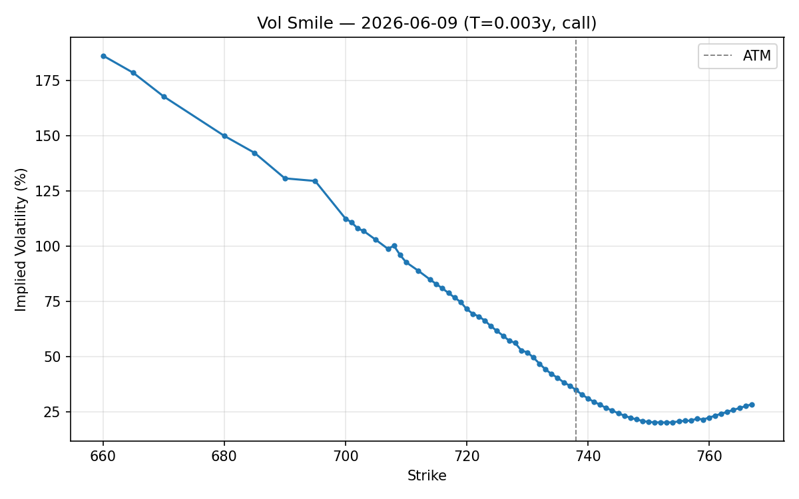
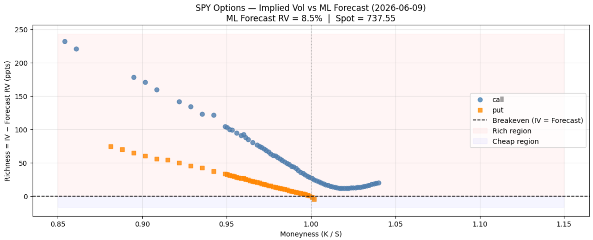

# Volatility Forecasting & Options Analytics

A Python library for pricing options, computing risk sensitivities (Greeks), Monte Carlo
simulation with variance reduction, implied-volatility solving, a real-data volatility
surface, and an ML model that forecasts realized volatility under rigorous, lookahead-free
time-series cross-validation.

---

## Demo


*Implied volatility vs. strike for SPY options across near-term expirations, showing the characteristic put skew.*


*Options flagged rich (IV above forecast realized vol) or cheap, based on the walk-forward vol forecast vs. current implied vol.*

---

## Setup

```bash
python -m venv .venv

# Windows
.venv\Scripts\activate
# macOS/Linux
source .venv/bin/activate

pip install -e ".[dev]"
```

Run tests:

```bash
pytest
```

Reproduce headline results (uses cached SPY data, no network required):

```bash
python scripts/reproduce_results.py
```

---

## Project structure

```
volforecast/
  pricing/      black_scholes.py, greeks.py, implied_vol.py
  montecarlo/   gbm.py, variance_reduction.py, exotic.py
  surface/      build_surface.py, plot.py
  vol/          realized_vol.py, estimators.py, garch.py
  forecast/     features.py, models.py, validation.py, metrics.py
  data/         loader.py, cache/
notebooks/      demo.ipynb
scripts/        reproduce_results.py
tests/
```

---

## Methodology

### Black-Scholes-Merton pricing

Under the risk-neutral GBM assumption (constant volatility, no jumps), the closed-form
European option price is:

```
C = S·e^(-qT)·N(d1) - K·e^(-rT)·N(d2)
P = K·e^(-rT)·N(-d2) - S·e^(-qT)·N(-d1)

d1 = [ln(S/K) + (r - q + sigma^2/2)·T] / (sigma·sqrt(T))
d2 = d1 - sigma·sqrt(T)
```

where `N` is the standard normal CDF, `q` is the continuous dividend yield, and `r` is the
risk-free rate.

### Greeks

Each Greek is the partial derivative of the option price with respect to one input:

| Greek | Formula | Interpretation |
|-------|---------|----------------|
| Delta | dC/dS = e^(-qT)·N(d1) | $ change in option per $1 move in spot |
| Gamma | d²C/dS² = e^(-qT)·phi(d1)/(S·sigma·sqrt(T)) | Rate of delta change |
| Vega  | dC/d(sigma) = S·e^(-qT)·phi(d1)·sqrt(T) | $ change per unit vol move |
| Theta | dC/dt (annualized) | Time decay |
| Rho   | dC/dr = K·T·e^(-rT)·N(d2) | Rate sensitivity |

All closed-form Greeks are verified against central finite differences in the test suite.

### Implied volatility

BSM price is strictly increasing in sigma (vega > 0 everywhere), so there is a unique
implied vol for any valid market price. The solver uses Newton-Raphson with vega as the
derivative, falling back to bisection when vega is near zero (deep ITM/OTM options where
the NR step is numerically unreliable). The implementation is vectorized over an entire
option chain.

### Monte Carlo pricing

Under the risk-neutral measure, the terminal stock price follows:

```
S_T = S · exp((r - q - sigma^2/2)·T + sigma·sqrt(T)·Z),   Z ~ N(0,1)
```

The option price is the discounted expectation of the payoff. Two variance-reduction
techniques are implemented:

**Antithetic variates:** for each draw Z, also evaluate the payoff at -Z. The negative
correlation between paired payoffs (Cov(f(Z), f(-Z)) < 0 for monotone payoffs) reduces
variance without introducing bias. On ATM calls this achieves ~75% variance reduction.

**Control variate:** use the discounted stock price X = e^(-rT)·S_T as a control. Its
expectation E[X] = S·e^(-qT) is known exactly. The optimal coefficient c* = Cov(Y,X)/Var(X)
is estimated in-sample; variance reduction equals 1 - rho^2(Y, X). For ATM calls the
correlation is ~0.92, giving ~85% variance reduction in practice.

Convergence to the Black-Scholes closed form is a primary correctness check:
MC price = 10.4634 ± 0.0331 vs. BS = 10.4506 (0.4 std-errors, seed=42, 200k paths).

### Realized volatility and baselines

The forecasting target is the annualized std of log-returns over a forward horizon h:

```
RV_t = sqrt(252) · std(log(S_{t+1}/S_t), ..., log(S_{t+h}/S_{t+h-1}))
```

RV_t uses only prices strictly after time t.

Two baselines:

**EWMA:** sigma_t^2 = lambda·sigma_{t-1}^2 + (1-lambda)·r_t^2, lambda=0.94 (RiskMetrics).
Uses only returns up to day t.

**GARCH(1,1):** sigma_t^2 = omega + alpha·r_{t-1}^2 + beta·sigma_{t-1}^2. Parameters fit
by maximum likelihood on training data inside each fold.

Range-based estimators (Parkinson, Garman-Klass) use daily high/low data for more efficient
vol estimation and are included in the ML feature set.

### Walk-forward cross-validation

Standard k-fold CV trains on future data and tests on the past, which is invalid for time
series. This project uses expanding-window walk-forward CV:

- Training starts at day 0 and grows by `step` days each fold. Test sets are contiguous
  and always strictly after the training set.
- **Purging:** for a horizon-h target, the h-1 samples just before the test fold have
  targets that overlap with the test period and are dropped from training.
- All fitting (model, scalers) happens on training data only, inside each fold.

The ML model (`HistGradientBoostingRegressor`) is tree-based and handles NaN features
natively. No scaler is needed.

---

## Results

Walk-forward CV on SPY, 2019-2024. Horizon = 5 trading days, min training = 252 days,
fold step = 21 days, N = 1252 test observations.

| Model | RMSE   | MAE    | QLIKE   | Corr  |
|-------|--------|--------|---------|-------|
| EWMA  | 0.1094 | 0.0695 | -2.4913 | 0.633 |
| GARCH | 0.1367 | 0.0834 | -2.3345 | 0.387 |
| ML    | 0.1456 | 0.0841 | -1.4186 | 0.314 |

EWMA outperforms both GARCH and the ML model on every metric. Short-horizon vol is heavily
autocorrelated, and EWMA captures that with a single parameter.

QLIKE (Patton 2011) measures calibration: a higher (less negative) value means predictions
are systematically off relative to realized variance. The ML model's QLIKE gap is larger
than its RMSE gap, pointing to miscalibration beyond pure point error.

---

## Limitations & next steps

**Data:** yfinance may have gaps, stale quotes, and survivorship bias. Not audited against
a paid source.

**Transaction costs:** no bid-ask spread, market impact, or financing costs are modeled.

**Black-Scholes:** assumes constant vol and lognormal returns. BSM is a benchmark here,
not a realistic pricing model.

**Dividends:** continuous yield only. No discrete dividends or early exercise.

**ML features:** only price-derived inputs. Macro indicators or implied vol signals could
improve generalization.

**Next steps:** stochastic vol (Heston), longer horizons, transaction-cost-adjusted signal
evaluation.

---

*For research and educational purposes only. Not investment advice.*
